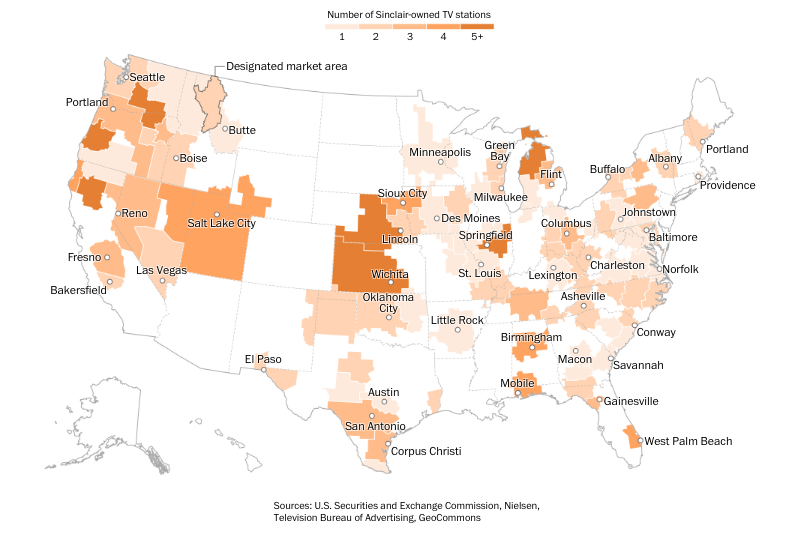
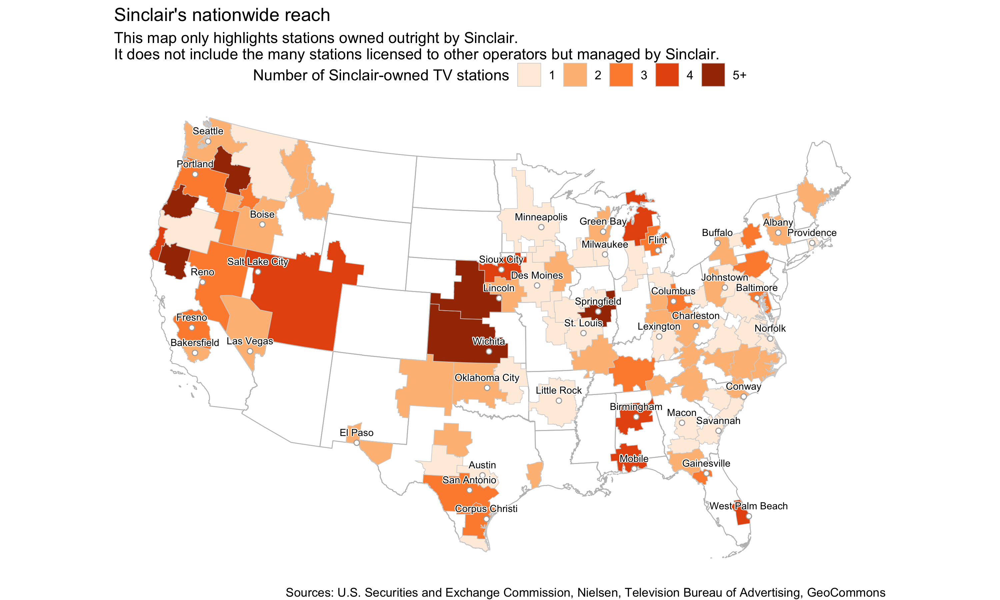

We're going to recreate the graphic from The Washington Post story: [As big chains gobble up small TV stations, merged newsrooms are creating a uniformity of news coverage](https://www.washingtonpost.com/graphics/2018/lifestyle/sinclair-broadcasting/).



The work was done by graphics editor [Chris Alcantara](https://twitter.com/chrisalcantara?lang=en), who used a mix of R, Excel, QGIS, and Illustrator to create this map. 

We're going to try to stick to R exclusively with the help of some packages like **jsonlite**, **tigris**, **dplyr**, **ggplot2**, **sf**, **ggrepel**, and **shadowtext**.

## Getting the data

There's a map on Sinclair's [website](http://sbgi.net/) showing off all their stations.

Grab the json [URL](http://sbgi.net/resources/assets/sbgi/MetaverseStationData.json) that's running the map.

We'll use the **jsonlite** package

```{r importing, warning=F, message=F}
#install.packages("tidyverse")
#install.packages("jsonlite")
#install.packages("stringr")

library(tidyverse)
library(stringr)
library(jsonlite)

json_url <-"http://sbgi.net/resources/assets/sbgi/MetaverseStationData.json"

## If the url above doesn't exist anymore uncomment the line below and run it
# json_url <- "MetaverseStationData.json"

stations <- fromJSON(json_url)

primary_stations <- stations %>% 
  filter(Channel=="Primary") %>% 
  mutate(
    Location=str_replace(Location, "Point \\(", ""),
    lat=str_replace(Location, " .*", ""),
    lon=str_replace(Location, ".* ", ""),
    lon=str_replace(lon, "\\)", ""))
```

Let's take a look at what we've got:

```{r glimpse}
glimpse(primary_stations)
```


Interesting. 

Well, our ultimate goal is to map this out so readers can see the scope of influence that this company reaches.


There are two data points that we can extract from this data set:

* latitude and longitude for each station
* the DMA, or Designated Market Area, each station is assigned to

We can map out the station locations quickly using the **sf** package to visualize latitude and longitude of each one on top of a map of the country downloaded using the **tigris** package.

**Note: **There are performance issues when creating maps with the sf package if you’re using a Mac. To fix,[ ]download and install](https://www.xquartz.org/) XQuartz. Restart and then run these commands: options(device = “X11”) and then X11.options(type = “cairo”)

## Mapping station locations

```{r dots, warning=F, message=F, fig.width=10, fig.height=6, quietly=T, echo=T, results='hide'}
# if you don't have sf or tigris installled yet, uncomment and run the lines below
# install.packages("sf")
# install.packages("tigris")

library(sf)
library(tigris)

station_latlon <- select(primary_stations, DMA_Short, Location) %>% unique() %>% 
  mutate(Location=gsub("Point \\(", "", Location)) %>% 
  mutate(Location=gsub("\\)", "", Location)) %>% 
  mutate(lon=as.numeric(gsub(" .*", "", Location))) %>% 
  mutate(lat=as.numeric(gsub(".* ", "", Location))) %>% 
  filter(!is.na(lon))


options(tigris_class = "sf")

states <- states(cb=T)

# Filter out some territories and states

states <- filter(states, !STUSPS %in% c("AK", "AS", "MP", "PR", "VI", "HI", "GU"))

# Converting the projection to Albers
states <- st_transform(states, 5070)

# Changing the projection of station_latlon so it matches the states sf dataframe map

station_latlon_projected <- station_latlon %>% 
  filter(!is.na(lon)) %>% 
  st_as_sf(coords=c("lon", "lat"), crs = "+proj=longlat") %>% 
  st_transform(crs=st_crs(states)) %>% 
  st_coordinates(geometry)

station_latlon <- cbind(station_latlon, station_latlon_projected)


# If you're using a Mac, uncomment and run the lines below
#options(device = "X11") 
#X11.options(type = "cairo")

ggplot(states) +
  geom_sf() +
  geom_point(data=station_latlon, aes(x=X, y=Y), color="blue") +
  theme_void() +
  theme(panel.grid.major=element_line(colour="transparent")) +
  labs(title="Station locations")

```

Alright, but let's figure out scope.

Let's figure out how many stations fall into a DMA based on the original JSON data we brought in.

```{r dma_count, warning=F, message=F}
# Fixing a bad data point

primary_stations$DMA_Code <- ifelse(primary_stations$DMA_Short=="Lincoln_NE", 722, primary_stations$DMA_Code)

## Summarizing by DMA
dma_totals <- primary_stations %>% 
  group_by(DMA, DMA_Code) %>% 
  count() %>% 
  arrange(desc(n)) %>% 
  ungroup() %>% 
  rename(dma_code=DMA_Code) %>% 
  mutate(dma_code=as.numeric(dma_code))

head(dma_totals)
```

What's the DMA footprint for each station?

Check around on the internet and you'll find sources for the DMA shapefile.

Here's one from [Harvard's Dataverse](https://dataverse.harvard.edu/dataset.xhtml?persistentId=doi:10.7910/DVN/IVXEHT).

Download the [dma_2008.zip](https://dataverse.harvard.edu/file.xhtml?persistentId=doi:10.7910/DVN/IVXEHT/YEEPYT&version=7.3) file, unzip it, and bring it into your project directory.

We'll read it in using the `st_read()` function from the **sf** package.

## Mapping DMAs

```{r dma_map, warning=F, message=F, fig.width=10, fig.height=6}

geo <- st_read("dma_2008/DMAs.shp")

# It doesn't have a CRS so we'll assign it one
st_crs(geo) <- 4326

# Converting the projection so it's Albers
geo <- st_transform(geo, 5070)

ggplot(geo) +
  geom_sf(color="red") +
  coord_sf()
```

Then we can join the DMA station count to it so we can visualize it.

## Mapping Sinclair DMAs

```{r dma_map_choropleth, warning=F, messaage=F, fig.width=10, fig.height=6}

# Prepping a column name to join on
geo <- geo %>% 
  mutate(dma_code=as.numeric(as.character(DMA)))


geo <- left_join(geo, dma_totals, by="dma_code") %>% 
  filter(!is.na(n)) 


ggplot() +
  geom_sf(data=states, color="red", fill=NA) +
  geom_sf(data=geo, aes(fill=n)) +
  coord_sf()
```

Wonderful.

We have all the components for the visualization now.

Let's style it up so it matches the one Chris made for the story.

We'll add the **station_latlon** data frame of station locations, too.

Gotta clean it up first and limit the cities displayed to avoid being cluttered.


```{r sf_map, warning=F, message=F, width=10, height=6}

# Filtering out locations based on map

cities <- c("Portland", "Seattle", "Butte", "Boise", "Reno", "Fresno", "Bakersfield", 
            "Reno", "Salt Lake City", "Las Vegas", "El Paso", "Austin", "San Antonio",
            "Corpus Christi", "Oklahoma City", "Wichita", "Lincoln", "Sioux City", 
            "Minneapolis", "Green Bay", "Milwaukee", "Des Moines", "Springfield", 
            "St. Louis", "Little Rock", "Flint", "Columbus", "Lexington", "Birmingham",
            "Mobile", "Macon", "Asheville", "Charleston", "Buffalo", "Johnstown", "Baltimore",
            "Norfolk", "Conway", "Savannah", "Gainesville", "West Palm Beach", "Albany",
            "Providence", "Portland")

station_latlon_filtered <- station_latlon %>% 
  mutate(DMA_Short= gsub("_.*", "", DMA_Short)) %>% 
  mutate(DMA_Short= gsub("Bozeman", "Butte", DMA_Short)) %>% 
  mutate(DMA_Short= gsub("Champaign", "Springfield", DMA_Short)) %>% 
  mutate(DMA_Short= gsub("Myrtle Beach", "Conway", DMA_Short)) %>% 
  mutate(DMA_Short= gsub("West Palm", "West Palm Beach", DMA_Short)) %>% 
  filter(DMA_Short %in% cities) %>% 
  group_by(DMA_Short) %>% 
  filter(row_number()==1)
```

Let's create bins for the number of stations per DMA-- we're turning continuous data into categorical data so it's easier to control the visualization.

Then we're going to use a couple of special packages that will help deal with the text on the map.

* [**ggrepel**](https://cran.r-project.org/web/packages/ggrepel/vignettes/ggrepel.html)
* [**shadowtext**](https://github.com/GuangchuangYu/shadowtext/)

```{r sf_map2, warning=F, message=F, width=10, height=6}
# Need to create bins for the numbers

geo <- geo %>% 
  mutate(bin=case_when(
    n == 1 ~ "1",
    n == 2 ~ "2",
    n == 3 ~ "3",
    n == 4 ~ "4",
    n >= 5 ~ "5+"
  ))

# install.packages("ggrepel")
library(ggrepel)

# install.packages("shadowtext")
library(shadowtext)
```

## Final map

We're layering our different shape files:

* The state borders
* The DMA borders we combined with the counts of them from the summarized Sinclair JSON file
* The locations of a few dozen stations we also extracted from the Sinclair JSON file

And we're adding a bunch of functions in there for styling, like `scale_fill_brewer()` and `geom_shadowtext()` and `geom_text_repel()` and various theme options.

```{r sf_map3, , warning=F, message=F, width=10, height=8}

ggplot() +
  geom_sf(data=states, color="gray", fill=NA, size=.3) +
  geom_sf(data=geo, aes(fill=bin), color="light gray", size=.2) +
  scale_fill_brewer(palette = "Oranges", name="Number of Sinclair-owned TV stations") +
  geom_point(data=station_latlon_filtered, aes(x=X, y=Y), 
             color="dark gray", fill="white", shape=21) +
  geom_shadowtext(data=station_latlon_filtered, aes(x=X, y=Y, label=DMA_Short), 
             color="black", bg.color="white", vjust=-1, size=2.5) +
  geom_text_repel() +
  coord_sf() +
  theme_void() +
  theme(panel.grid.major = element_line(colour = 'transparent'),
        legend.position="top", legend.direction="horizontal") +
  labs(title="Sinclair's nationwide reach",
       subtitle="This map only highlights stations owned outright by Sinclair. 
It does not include the many stations licensed to other operators but managed by Sinclair.",
       caption="Sources: U.S. Securities and Exchange Commission, Nielsen, Television Bureau of Advertising, GeoCommons")

ggsave("sinclair_ggplot.png", width=10, height=6, units="in")

```

Here's how it looks saved as a PNG file.



Compare it to the [original](https://www.washingtonpost.com/graphics/2018/lifestyle/sinclair-broadcasting/). Not bad, right?


